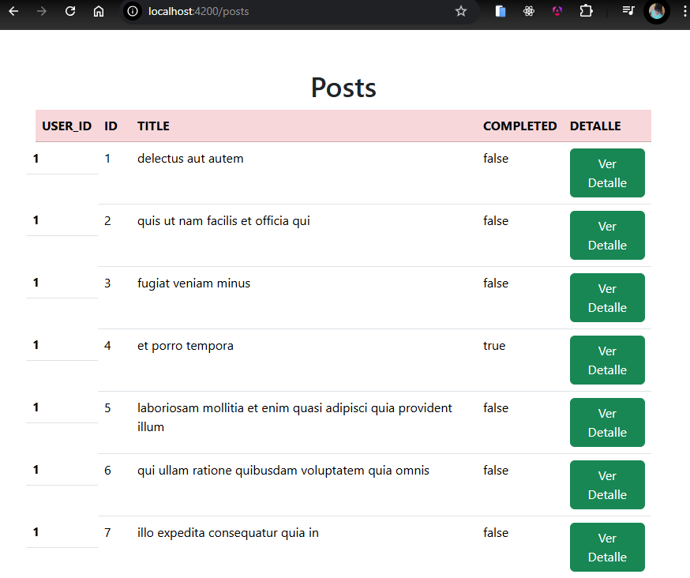
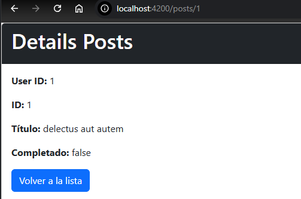

# MiAppAngular14

This project was generated with [Angular CLI](https://github.com/angular/angular-cli) version 14.x.

# Para levantar el proyecto:
npm start

Inicio del Proyecto: nos encontramos con la lista de Post provenientes de la Api dada, contiene las columnas userId,id,title,completed y el boton para ver el detalle de cada fila:  

Luego en la URL http://localhost:4200/posts/{id}, podemos ver el detalle de cada contenido seleccionado.

# Para este Proyecto se uso: 

# Framework/Librería Principal:

Angular (versión 14).
# Lenguajes:
TypeScript.
HTML.
CSS.
Bootstrap.

# Manejo de Datos y Lógica Asíncrona:

RxJS.
Observables.
subscribe().
map().
BehaviorSubject.

# Comunicación con el Backend:

HttpClient.
HttpClientModule.
GET.
URLs de la API: https://jsonplaceholder.typicode.com/todos/ para la lista de posts y https://jsonplaceholder.typicode.com/todos/{id} .
environment.ts y environment.prod.ts.

# Routing y Navegación:

@angular/router.
Router.
RouterLink.
Routes.

# Componentes y Estructura:

Componentes.
@Component() decorator.
templateUrl y styleUrls.
selector: .

# Directivas:
*ngFor.
*ngIf.

# Servicios:
Servicios (@Injectable()).
Inyección de dependencias.

